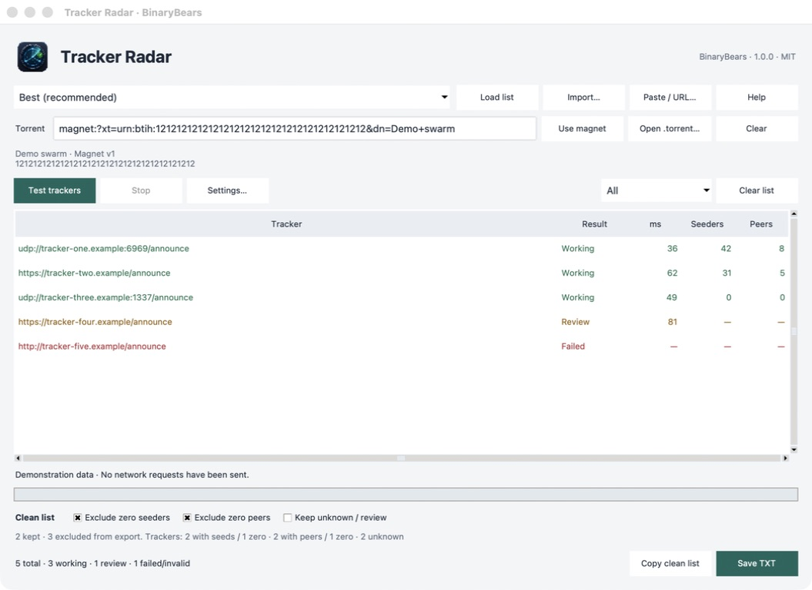

# Tracker Radar

Desktop BitTorrent tracker diagnostics by **BinaryBears**. Version **1.0.0**, MIT licensed.

[Website](https://binarybearsllc.github.io/Tracker-Radar/) · [Downloads](https://github.com/BinaryBearsLLC/Tracker-Radar/releases/latest) · [Verification](VERIFICATION.md)



## Check, filter, export

1. Load a tracker list from TXT, a URL, paste, or an ngosang preset.
2. Optionally add a magnet or `.torrent` to query per-tracker seeders and incomplete peers.
3. Test UDP, HTTP and HTTPS directly from your connection.
4. Exclude zero seeders and/or peers if needed, then **Copy clean list** or **Save TXT**.

A valid BitTorrent response establishes a working tracker; DNS, an open port and HTTP 200 alone do not. Unknown statistics are not zero. Review is opt-in, and failed, invalid and untested entries never enter the clean export. The original list is preserved.

Private torrent files use only embedded trackers; cross-origin tracker redirects are blocked. Magnets cannot reliably identify private torrents. Trackers see your IP and queried hash. There is no telemetry, account, backend, DHT, peer connection or content download. Never add tracker counts as unique swarm totals.

## Download

| Platform | Package | Requirements |
| --- | --- | --- |
| macOS Universal | DMG | macOS 11+, Apple Silicon or Intel |
| Windows x64 | ZIP | Windows 10+, Intel/AMD 64-bit |
| Linux x64 | TAR.GZ | glibc 2.36+, X11/XWayland |

Get packages and SHA-256 checksums from [GitHub Releases](https://github.com/BinaryBearsLLC/Tracker-Radar/releases). On macOS, open the DMG and drag Tracker Radar to Applications. On Windows and Linux, extract the entire archive. Python is bundled. Signing/notarization status is stated in each release. The app is Python/Tk, with an English interface.

## Development

Use Python 3.13 with Tk. Build on the target operating system.

```sh
python3 -m venv .venv
.venv/bin/python -m pip install -r requirements-build.txt
.venv/bin/python -m unittest discover -s tests -v
.venv/bin/python tracker_radar.py --smoke-test
.venv/bin/python scripts/gui_qa.py
.venv/bin/python tracker_radar.py
```

On Windows, invoke `.venv\Scripts\python.exe` directly; activation or execution-policy changes are unnecessary. On headless Linux, prefix GUI commands with `xvfb-run -a`.

```sh
.venv/bin/python build.py
.venv/bin/python package.py macOS-Universal # Windows-x64 or Linux-x64 on those hosts
```

A Universal Mac build requires Universal Python/Tk and `MACOS_TARGET_ARCH=universal2`. `package.py` checks actual executable architecture; it does not infer it from the host. For an authorized local Developer ID build, set `MACOS_SIGN_IDENTITY`. Release Mac builds require Developer ID signing and Apple notarization for both the app and DMG. See [Signing](SIGNING.md) for the local and GitHub Actions setup. Ordinary CI builds use an ad-hoc ZIP.

## Automation and releases

`Build and release` tests and builds exactly three targets on pushes, pull requests and manual runs. A `v*` tag publishes only after all three build jobs pass, the tag matches `APP_VERSION`, and the expected assets are present. Action dependencies use pinned commits. The official macOS Python installer is pinned by SHA-256 and signature checked. Linux builds in a Debian 12 Python container.

For a release: update `APP_VERSION`, website version/download links, release notes and verification; test locally; commit; push an explicitly approved `vX.Y.Z` tag. Do not relabel old binaries. Inspect all three jobs and the published checksums. `GitHub Pages` validates and deploys only `site/` from `main`.

The original 3.1.0 handoff archives remain local in ignored `prebuilt/`; `python3 verify_prebuilt.py` verifies them when present. They are historical inputs, not public 1.0.0 downloads.

## License

Copyright 2026 BinaryBears LLC. Application code is MIT licensed. Bundled dependencies retain their licenses: [THIRD_PARTY_NOTICES.md](THIRD_PARTY_NOTICES.md), [assets/licenses](assets/licenses/). [ngosang/trackerslist](https://github.com/ngosang/trackerslist) supplies optional presets.
